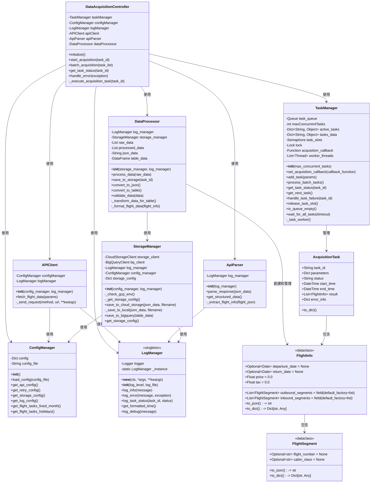

# 雄獅旅遊機票資料擷取系統 - 類別圖

## 類別圖概述

本文件描述雄獅旅遊機票資料擷取系統的類別設計。類別圖展示了系統中各個類別的結構、職責以及它們之間的關係，為系統實現提供了藍圖。

## Mermaid 類別圖代碼

## 類別職責詳細說明

### 1. 控制與管理類

#### `DataAcquisitionController`（資料擷取控制器）
- **職責**：作為系統流程的總指揮，協調 `APIClient`、`ApiParser` 和 `DataProcessor` 完成資料的獲取、解析與儲存。
- **主要方法**：
  - `initialize()`: 初始化控制器及所有需要的服務組件。
  - `start_acquisition(task_id)`: 開始單個資料擷取任務。
  - `batch_acquisition(task_list)`: 批次執行多個任務。
  - `get_task_status(task_id)`: 獲取特定任務的狀態。
  - `handle_error(exception)`: 處理執行過程中的錯誤。
  - `_execute_acquisition_task(task_id)`: 執行單個擷取任務的完整流程。
- **關聯**：
  - 使用 `TaskManager` 管理任務。
  - 使用 `APIClient` 獲取原始數據。
  - 使用 `ApiParser` 解析數據。
  - 使用 `DataProcessor` 處理並儲存數據。

#### `TaskManager`（任務管理器）
- **職責**：管理資料擷取任務隊列，控制並行任務數量，確保系統資源合理利用。
- **主要屬性**：
  - `task_queue`: 任務隊列，存儲待執行的任務。
  - `maxConcurrentTasks`: 最大並行任務數。
  - `active_tasks`: 當前活動的任務字典。
  - `tasks_data`: 所有任務數據字典。
  - `task_slots`: 信號量，用於控制並行任務數。
  - `lock`: 鎖，用於同步訪問共享資源。
  - `acquisition_callback`: 資料擷取控制器回調函數。
  - `worker_threads`: 工作線程列表
- **主要方法**：
  - `__init__(max_concurrent_tasks)`: 初始化任務管理器。
  - `set_acquisition_callback(callback_function)`: 設置回調函數。
  - `add_task(params)`: 添加新任務到隊列。
  - `process_batch_tasks()`: 處理批量任務。
  - `get_task_status(task_id)`: 獲取任務狀態。
  - `get_next_task()`: 獲取下一個任務。
  - `handle_task_failure(task_id)`: 處理任務失敗。
  - `release_task_slot()`: 釋放任務槽位。
  - `is_queue_empty()`: 檢查隊列是否為空。
  - `wait_for_all_tasks(timeout)`: 等待所有任務完成。
  - `_task_worker()`: 任務工作線程/協程函數。
- **關聯**：
  - 管理 `AcquisitionTask` 對象。

### 2. API 客戶端

#### `APIClient`
- **職責**：專門負責與雄獅旅遊 API 進行網路通訊。封裝 HTTP 請求的細節，處理網路層級的錯誤，並返回原始的 API 響應。
- **主要方法**：
  - `__init__(config_manager, log_manager)`: 初始化客戶端。
  - `fetch_flight_data(params)`: 根據參數獲取航班資料。
  - `_send_request(method, url, **kwargs)`: 內部方法，發送實際的 HTTP 請求。
- **關聯**：
  - 使用 `ConfigManager` 獲取 API 端點、金鑰等配置。
  - 使用 `LogManager` 記錄請求過程。

### 3. 數據處理類

#### `ApiParser`（API 解析器）
- **職責**：接收原始的 JSON 數據，並將其解析、轉換為系統內部使用的結構化資料模型（如 `FlightInfo`）。
- **主要方法**：
  - `__init__(log_manager)`: 初始化解析器。
  - `parse_response(json_data)`: 解析 API 的 JSON 響應。
  - `get_structured_data()`: 獲取結構化的數據。
  - `_extract_flight_info(flight_json)`: 從 JSON 物件中提取單筆航班資訊。
- **關聯**：
  - 使用 `LogManager` 記錄解析過程中的事件。

#### `DataProcessor`（數據處理器）
- **職責**：接收結構化數據，將其轉換為最終需要儲存的格式（如 JSON 或表格），並交給 `StorageManager`。
- **主要屬性**：
  - `log_manager`: 日誌管理器實例
  - `storage_manager`: 存儲管理器實例
  - `raw_data`: 原始數據
  - `processed_data`: 處理後的數據
  - `json_data`: JSON格式數據
  - `table_data`: 表格格式數據
- **主要方法**：
  - `__init__(storage_manager, log_manager)`: 初始化數據處理器
  - `process_data(raw_data)`: 處理原始數據
  - `save_to_storage(task_id)`: 將數據保存到存儲系統
  - `convert_to_json()`: 轉換為JSON格式
  - `convert_to_table()`: 轉換為表格格式
  - `validate_data(data)`: 驗證數據完整性
  - `_transform_data_for_table()`: 內部方法，將數據轉換為表格格式
  - `_format_flight_data(flight_info)`: 內部方法，格式化航班數據
- **關聯**：
  - 使用 `StorageManager` 存儲數據
  - 創建和管理 `FlightInfo` 對象

### 4. 存儲管理類

#### `StorageManager`（存儲管理器）
- **職責**：管理數據存儲操作，與 Cloud Storage 和 BigQuery 交互
- **主要屬性**：
  - `storage_client`: Cloud Storage客戶端
  - `bq_client`: BigQuery客戶端
  - `log_manager`: 日誌管理器實例
  - `config_manager`: 配置管理器實例
  - `storage_config`: 存儲配置字典
- **主要方法**：
  - `__init__(config_manager, log_manager)`: 初始化存儲管理器
  - `_check_gcp_env()`: 檢查是否在Google Cloud環境中運行
  - `_get_storage_config()`: 獲取存儲配置
  - `save_to_cloud_storage(json_data, filename)`: 保存JSON數據到Cloud Storage
  - `_save_to_local(json_data, filename)`: 將數據保存到本地（備份方案）
  - `save_to_bigquery(table_data)`: 保存表格數據到BigQuery
  - `get_storage_config()`: 獲取存儲配置
- **關聯**：
  - 使用 `ConfigManager` 獲取存儲配置
  - 使用 `LogManager` 記錄存儲操作

### 5. 配置與日誌類

#### `ConfigManager`（配置管理器）
- **職責**：管理系統配置，如 API 端點、重試策略、存儲配置等
- **主要屬性**：
  - `config`: 配置字典
  - `config_file`: 配置文件路徑
- **主要方法**：
  - `__init__()`: 初始化配置管理器
  - `load_config(config_file)`: 從文件加載配置
  - `get_api_config()`: 獲取 API 相關配置
  - `get_retry_config()`: 獲取重試配置
  - `get_storage_config()`: 獲取存儲配置
  - `get_log_config()`: 獲取日誌配置
  - `get_flight_tasks_fixed_month()`: 獲取固定月份的航班任務
  - `get_flight_tasks_holidays()`: 獲取節假日的航班任務

#### `LogManager`（日誌管理器）
- **職責**：管理系統日誌，記錄關鍵操作和錯誤
- **設計模式**：單例模式，確保系統中只有一個日誌管理實例
- **主要屬性**：
  - `logger`: 內部日誌記錄器
  - `_instance`: 類靜態變量，存儲唯一實例
- **主要方法**：
  - `__new__(cls, *args, **kwargs)`: 實現單例模式
  - `__init__(log_level, log_file)`: 初始化日誌管理器，設置日誌級別和輸出文件
  - `log_info(message)`: 記錄信息
  - `log_error(message, exception)`: 記錄錯誤
  - `log_task_status(task_id, status)`: 記錄任務狀態
  - `get_formatted_time()`: 獲取格式化的當前時間
  - `log_debug(message)`: 記錄調試信息

### 6. 數據模型類

#### `FlightInfo`（航班信息 - DataClass）
- **職責**：表示單個機票的信息，包含去程和回程的所有航段
- **主要屬性**：
  - `departure_date`: 出發日期 (Optional[date] = None)
  - `return_date`: 返回日期 (Optional[date] = None)
  - `price`: 票價 (float = 0.0)
  - `tax`: 稅金 (float = 0.0)
  - `outbound_segments`: 去程航段列表 (List[FlightSegment] = field(default_factory=list))
  - `inbound_segments`: 回程航段列表 (List[FlightSegment] = field(default_factory=list))
- **主要方法**：
  - `to_json() -> str`: 轉換為JSON格式，返回包含航班資訊的 JSON 字串
  - `to_dict() -> Dict[str, Any]`: 轉換為字典格式，返回包含航班資訊的字典

#### `FlightSegment`（航班段 - DataClass）
- **職責**：表示單個航班段的詳細信息
- **主要屬性**：
  - `flight_number`: 航班編號 (Optional[str] = None)
  - `cabin_class`: 艙等 (Optional[str] = None)
- **主要方法**：
  - `to_json() -> str`: 將航班段資訊轉換為 JSON 格式，返回包含航班段資訊的 JSON 字串
  - `to_dict() -> Dict[str, Any]`: 將航班段資訊轉換為字典格式，返回包含航班段資訊的字典

#### `AcquisitionTask`（擷取任務）
- **職責**：表示單個資料擷取任務
- **主要屬性**：
  - `task_id`: 任務ID
  - `parameters`: 擷取參數
  - `status`: 任務狀態
  - `start_time`: 開始時間
  - `end_time`: 結束時間
  - `result`: 任務結果
  - `error_info`: 錯誤信息
- **主要方法**：
  - `to_dict()`: 轉換為字典格式
