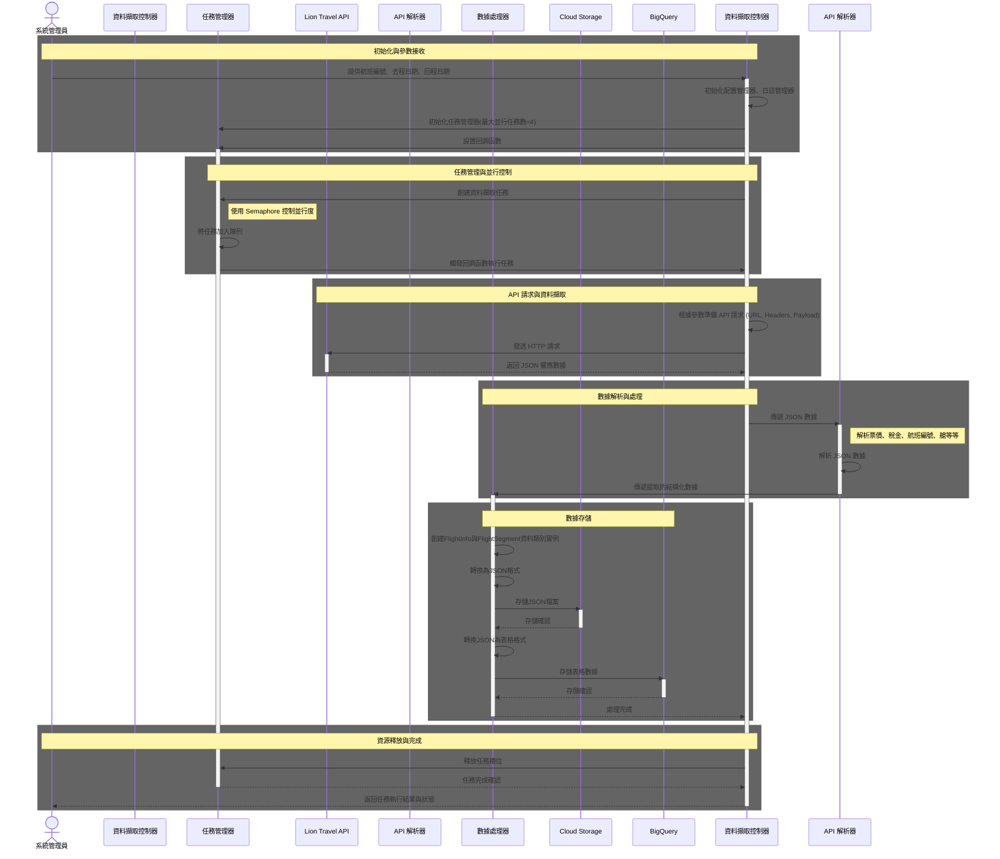

# 雄獅旅遊機票資料擷取系統 - 序列圖

## 序列圖概述

本文件描述雄獅旅遊機票資料擷取系統的工作流程序列圖。此序列圖展示了系統如何根據指定參數（航班編號、去程日期、回程日期）透過 API 擷取機票資料，並將資料存儲到Cloud Storage和BigQuery中的完整流程。

## Mermaid 序列圖代碼

## 序列圖詳細說明

序列圖展示了雄獅旅遊機票資料擷取系統的完整流程，主要分為以下幾個階段：

### 1. 初始化與參數接收
- **參與者**：系統管理員、資料擷取控制器、任務管理器
- **描述**：系統管理員提供必要參數（航班編號、去程日期、回程日期），資料擷取控制器接收這些參數並準備開始執行任務。控制器在初始化階段會配置日誌管理器(LogManager)。
- **輸入**：航班編號、去程日期、回程日期
- **輸出**：初始化的資料擷取任務

### 2. 任務管理與並行控制
- **參與者**：資料擷取控制器、任務管理器
- **描述**：控制器將參數傳遞給任務管理器，任務管理器負責創建任務並控制並行執行數量。使用 Semaphore 機制限制同時最多執行4個並行任務。
- **技術細節**：
  - 使用 Python 的 asyncio.Semaphore 實現並行控制
  - 任務管理器維護任務隊列
  - 通過回調函數機制實現任務執行

### 3. API 請求與資料擷取
- **參與者**：資料擷取控制器、Lion Travel API
- **描述**：控制器根據接收到的參數準備 API 請求（包含 URL、Headers、Payload），並向雄獅旅遊的 API 端點發送 HTTP 請求以獲取資料。
- **技術細節**：
  - 使用 `aiohttp` 或 `requests` 函式庫發送請求
  - 處理 API 的認證機制
  - 配置適當的超時設置

### 4. 數據解析與處理
- **參與者**：資料擷取控制器、API 解析器、數據處理器
- **描述**：API 解析器接收到來自 API 的 JSON 響應後，從中提取所需的所有數據，並交給數據處理器進行後續處理。
- **技術細節**：
  - 解析 JSON 格式的數據
  - 實現錯誤處理和重試機制
  - 確保數據完整性

### 5. 數據存儲
- **參與者**：數據處理器、Cloud Storage、BigQuery
- **描述**：數據處理器創建資料類別實例，將數據轉換為JSON格式並存儲到Cloud Storage，最後將JSON數據轉換為表格格式並存儲到BigQuery。
- **技術細節**：
  - 使用 DataClass 簡化數據模型
  - 實現數據格式轉換
  - 使用 Google Cloud 客戶端庫

### 6. 資源釋放與完成
- **參與者**：資料擷取控制器、任務管理器、系統管理員
- **描述**：任務完成後，確保所有資源被正確釋放，包括釋放任務槽位，並向系統管理員報告執行結果。
- **技術細節**：
  - 實現完整的資源清理流程
  - 使用 try-finally 確保資源釋放
  - 提供詳細的執行狀態報告

## 非同步處理考量

為了滿足在2小時內完成30組擷取任務的需求，系統將採用非同步處理機制：

1. **任務佇列**：使用 Python 的 `asyncio.Queue` 實現任務隊列管理。
2. **並行執行限制**：使用 `Semaphore` 控制同時執行的 API 請求數量。
3. **資源管理**：根據系統資源限制，合理分配CPU和記憶體資源。
4. **錯誤處理**：實現錯誤重試機制，當 API 請求失敗時能夠自動重試。
5. **任務優先級**：可以實現任務優先級機制，確保重要任務優先執行。

## 安全與 API 使用考量

1. **請求頻率**：遵循 API 的 Rate Limit 規範，在連續請求之間添加適當延遲。
2. **User-Agent**：使用合適的 User-Agent 頭，表明客戶端身份。
3. **IP代理**：必要時可考慮使用IP代理服務，避免因請求頻繁而被限制。
4. **API 使用條款**：尊重並遵循目標 API 的服務條款(Terms of Service)。 